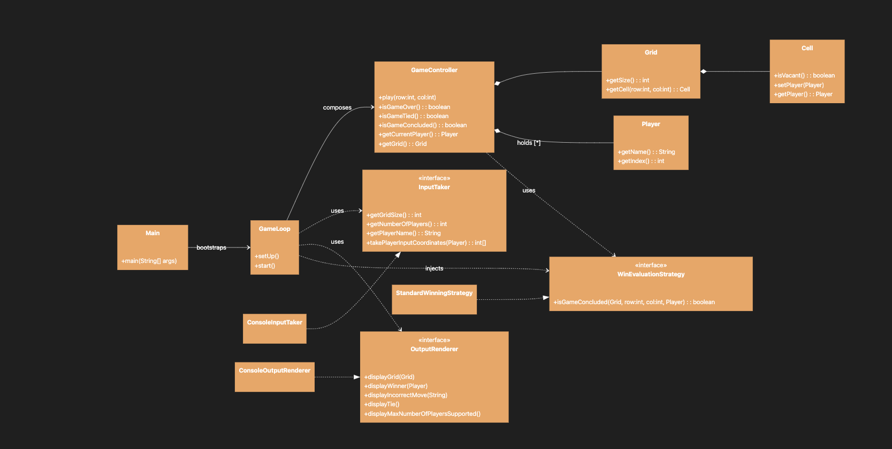
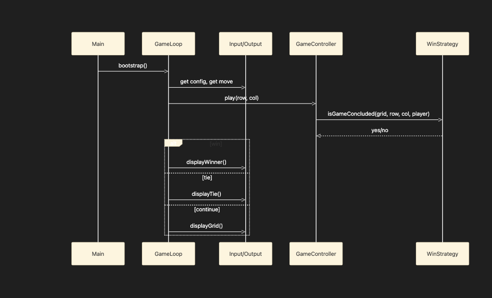

# Tic Tac Toe

## Architecture Overview

This TicTacToe implementation follows SOLID principles and uses design patterns like Strategy and Dependency Injection for extensible, testable code.

### Class Diagram


### Sequence Diagram


## Key Design Features

- **Dynamic board size and N-player support** - configurable grid size and player count
- **Strategy pattern** - pluggable win evaluation via [WinEvaluationStrategy](cci:2://file:///Users/pgarg3/Desktop/data/personal/DesignPatternsImpl/src/TicTacToe/interfaces/WinEvaluationStrategy.java:5:0-7:1)
- **Dependency injection** - [GameController](cci:2://file:///Users/pgarg3/Desktop/data/personal/DesignPatternsImpl/src/TicTacToe/controller/GameController.java:0:0-33:5) receives strategy and dependencies via constructor
- **Clean separation** - domain logic, UI adapters, and orchestration are decoupled
- **Extensible IO** - console implementation via [InputTaker](cci:2://file:///Users/pgarg3/Desktop/data/personal/DesignPatternsImpl/src/TicTacToe/interfaces/InputTaker.java:4:0-9:1) and [OutputRenderer](cci:2://file:///Users/pgarg3/Desktop/data/personal/DesignPatternsImpl/src/TicTacToe/interfaces/OutputRenderer.java:5:0-11:1) interfaces

## How to Run

```bash
javac -cp . src/TicTacToe/Main.java
java -cp . src.TicTacToe.Main
```

## Architecture Quality Score

| Principle/Aspect | Score | Notes |
|------------------|-------|-------|
| SRP | 9/10 | Clean separation across all classes |
| OCP | 9/10 | Extensible via strategies and interfaces |
| LSP | 10/10 | Simple, substitutable interfaces |
| ISP | 10/10 | Excellent after refactor |
| DIP | 9/10 | Good abstraction usage |
| Testability | 8/10 | All dependencies injectable |
| Maintainability | 9/10 | Clear structure, good naming |
| Extensibility | 9/10 | Easy to add new UIs, rules, board sizes |